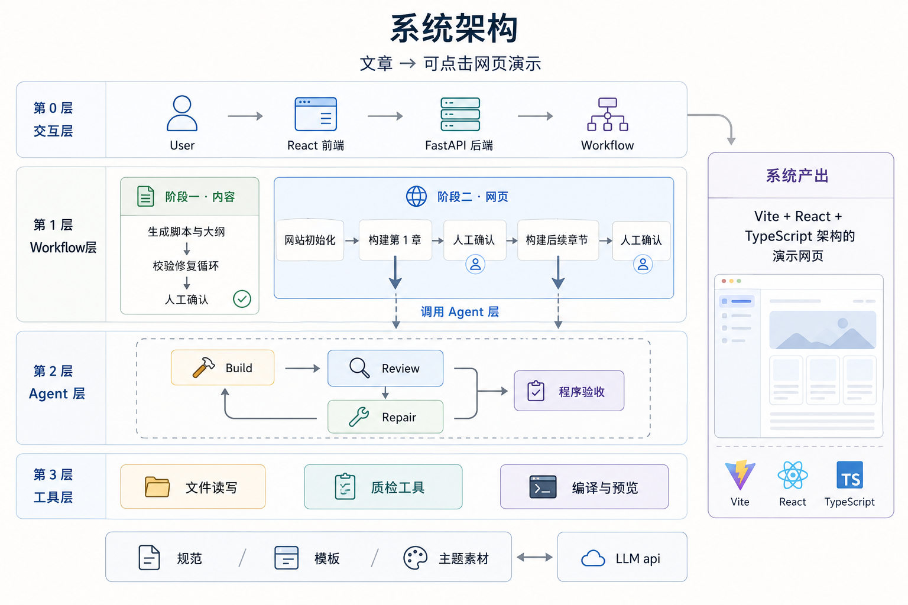
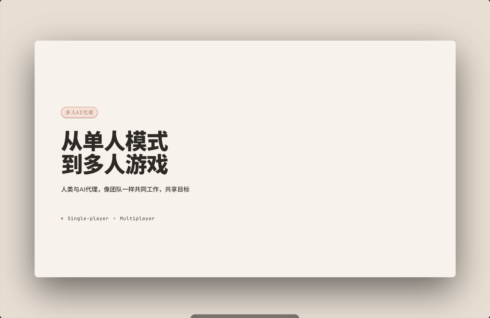
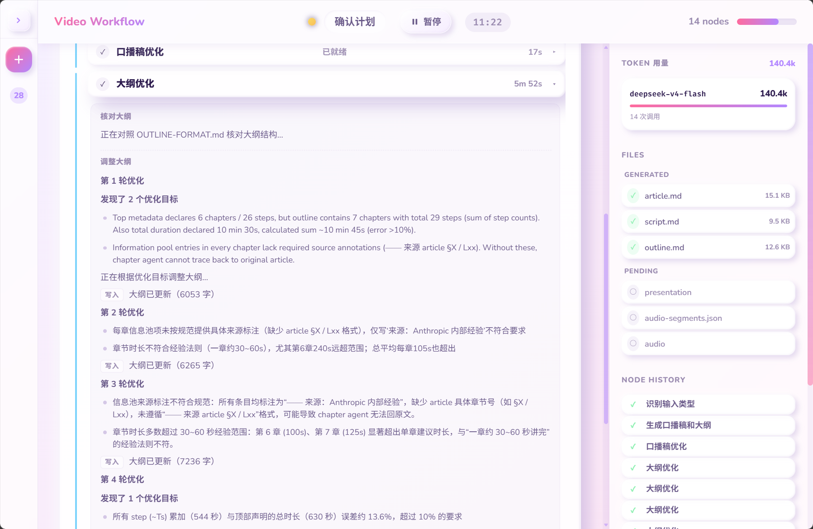
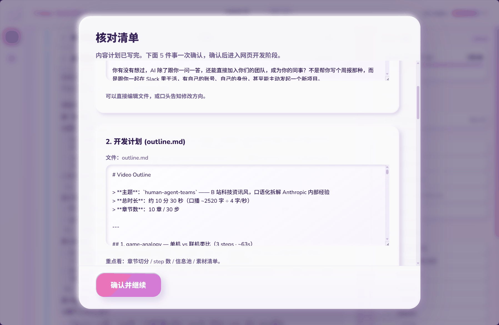
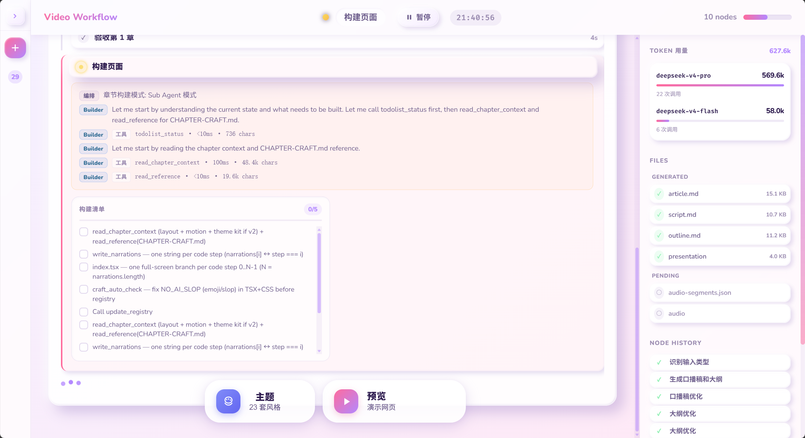
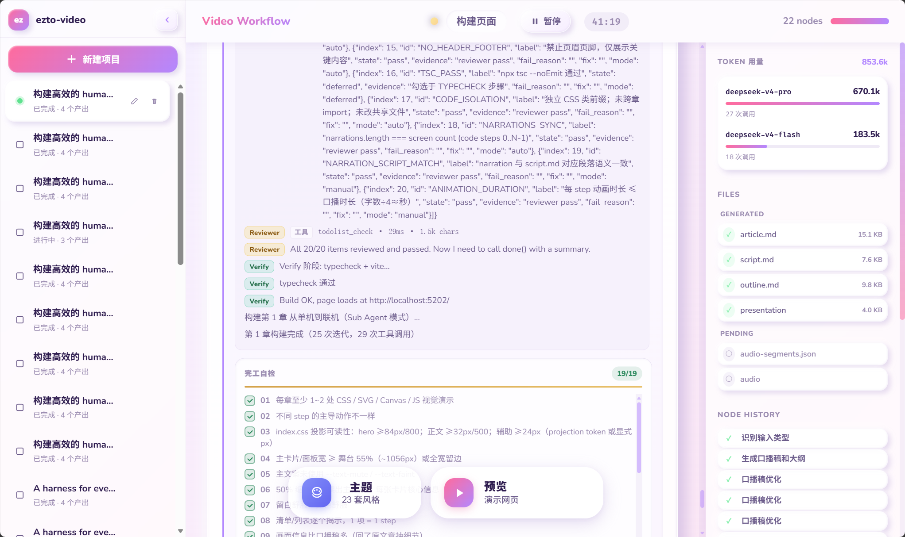

<div align="center">

# ezto_video

把文章做成可点击播放的网页演示

[](https://github.com/langchain-ai/langgraph)
[](https://fastapi.tiangolo.com/)
[](https://vitejs.dev/)

</div>

<br/>

<p align="center">
  
</p>

---

## 项目说明

面向「演示网站」生成的 **Agent Harness**。

用户上传一篇文章，系统按流程做成可点击的 React 演示网页。关键节点等待用户确认；内容和代码按既定规范反复检查、修改，直到达标。

演示网页支持 23 套主题。详见 [主题一览](docs/themes.md)。

<p align="center">
  
</p>
<p align="center"><sub>产出网页示例</sub></p>

Harness分层设计：

- ⚙️ **Workflow** — 确定性逻辑
- 🤖 **Agent** — 动态决策

---

## 流程

### 上传文章

从控制台新建项目，粘贴文章。

<p align="center">
  
</p>
<p align="center"><sub>首页</sub></p>

<p align="center">
  
</p>
<p align="center"><sub>新建项目</sub></p>

### 第一阶段：脚本和大纲

根据上传的文章拆分章节，生成逐章节的脚本和大纲。大模型会按规范要求不断检测、修改，直到达标，再交给用户审核。

<p align="center">
  
</p>
<p align="center"><sub>用户审核脚本 / 大纲</sub></p>
<p align="center">
  
</p>
<p align="center"><sub>核对清单（脚本 / 大纲 / 主题 / 素材 / 开发模式）</sub></p>

### 第二阶段：搭建第一章

多个 sub-agent 根据第一章大纲搭建对应的演示网页（React）。开发和自检清单是提前规定好的：改代码、跑通网页、再检查，循环到清单里的要求都完成，再交给用户确认。

<p align="center">
  
</p>
<p align="center">
  
</p>
<p align="center"><sub>搭建过程</sub></p>

<p align="center">
  
</p>
<p align="center"><sub>确认第一章</sub></p>

### 第三阶段：完成剩余章节

后面的章节参照第一章进行开发，直到整份 slide 网页做完。

<p align="center">
  
</p>
<p align="center"><sub>演示页面示例</sub></p>

| 计划后续做音频合成（TTS）和录屏。暂未开发相关功能


---

## 目录结构

```text
ezto_video/
├── ezto-agent/                      # 后端、工作流、前端
│   ├── src/backend/                 # FastAPI
│   ├── src/harness/                 # LangGraph 与 agent
│   ├── src/frontend/                # 控制台
│   ├── assets/                      # 模板、主题、规范文档
│   └── runtime/                     # 日志、缓存、工作区
├── skills/web-video-presentation/   # Skill 规范
└── docs/figures/                    # README 截图
```

---

## 启动

### 后端（WSL + conda）

```bash
# 首次执行时需创建环境：
conda create -n ezto python=3.12 -y && conda activate ezto
cd ezto-agent && pip install -e .
cp .env.example .env   # 填写 DEEPSEEK_API_KEY 等
cd ..

# 启动服务
cd ezto-agent/src
conda activate ezto
uvicorn backend.api.server:app --reload --port 8001
```

一键配置：`bash ezto-agent/scripts/setup_wsl.sh`

### 前端

```bash
cd ezto-agent/src/frontend
npm install && npm run dev   # http://localhost:5173
```


<details>
<summary>API</summary>

| 方法 | 路径 | 说明 |
|:---:|:---|:---|
| POST | `/api/workflow/start` | 启动工作流 |
| POST | `/api/workflow/{id}/resume` | 审核通过后继续 |
| GET | `/api/workflow/{id}` | 查询状态 |
| GET | `/api/workflow/{id}/events` | SSE 事件流 |
| GET | `/api/workflow/{id}/artifacts` | 列出产出文件 |
| GET | `/api/themes` | 主题列表 |
| GET | `/health` | 健康检查 |

</details>

---

## 相关文档

- [`skills/web-video-presentation/SKILL.md`](skills/web-video-presentation/SKILL.md) — 完整规范
- [`docs/themes.md`](docs/themes.md) — 23 套主题一览
- [`docs/web_video_graph_guide.md`](docs/web_video_graph_guide.md) — 图结构说明